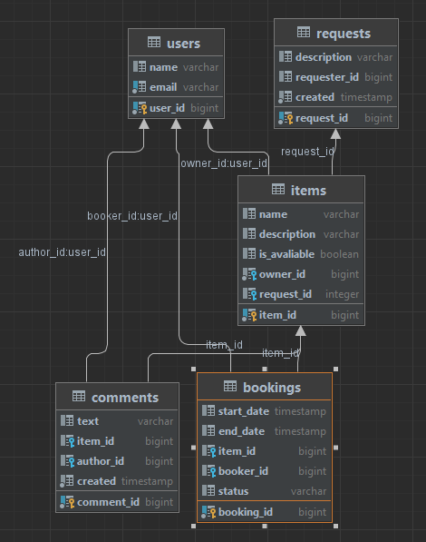

# ShareIt
___

*Проект, выполненный в рамках Яндекс Практикума, состоящий из двух сервисов (сервис валидации запросов, основной сервис).*
___

Это приложение-сервис для шеринга вещей, который дает возможность пользователям рассказывать, какими вещами они готовы поделиться, 
а так же, находить нужную вещь и брать её в аренду на какое-то время.
## Стек
       

### Функционал

Сервис позволяет бронировать вещь на определённые даты и закрывает к ней доступ на время бронирования от других желающих. 
На случай, если нужной вещи на сервисе нет, у пользователей есть возможность оставлять запросы. 
По запросу можно будет добавлять новые вещи для шеринга.

После валидации в **gateway** запрос отправляется основному приложению **server**, 
которое делает всю реальную работу — в том числе обращается к базе данных.

Взаимодействие между сервисами происходит через REST с помощью RestTemplate.

---
### ERD

### Возможности по улучшению
Использовать WebClient вместо RestTemplate, реализовать кеширование в gateway.

### Тестирование приложения
- реализованы юнит-тесты для всего кода, содержащего логику;
- реализованы интеграционные тесты, проверяющие взаимодействие с базой данных;
- реализованы тесты для REST-эндпоинтов с использованием MockMVC.
- реализованы тесты для слоя репозиториев с кастомными запросами.
- реализованы тесты для работы с JSON для DTO.

### Запуск
Запуск через Docker и docker-compose. 
